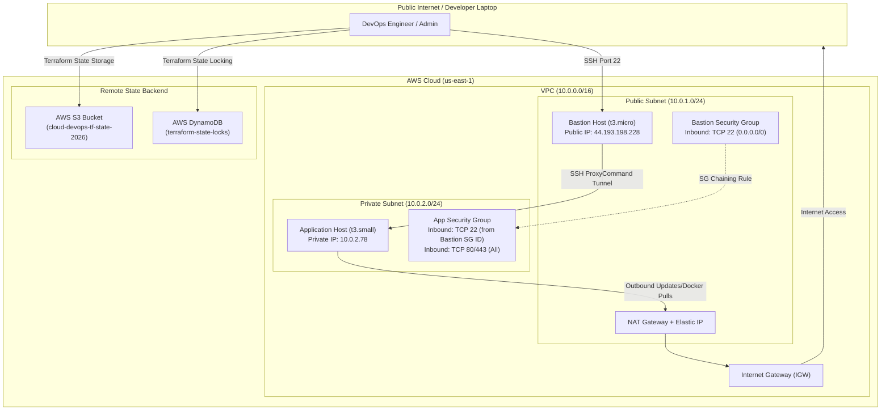
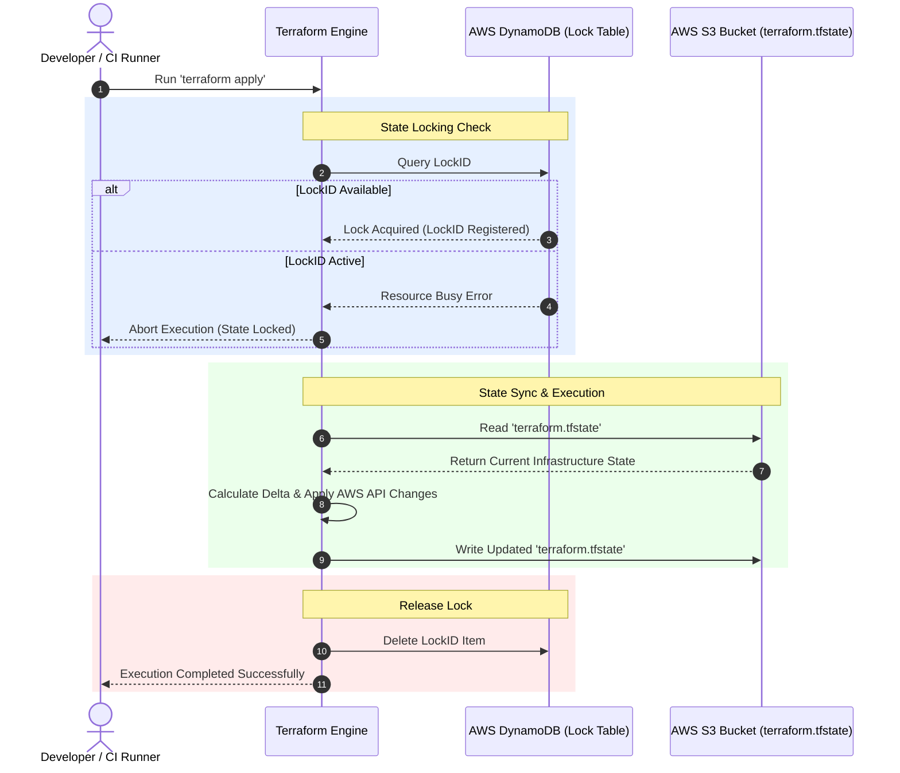
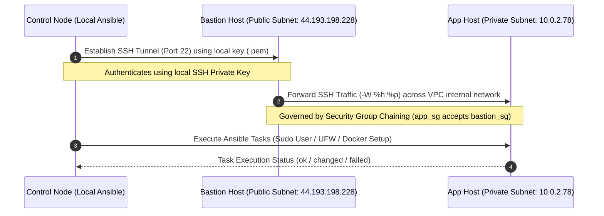
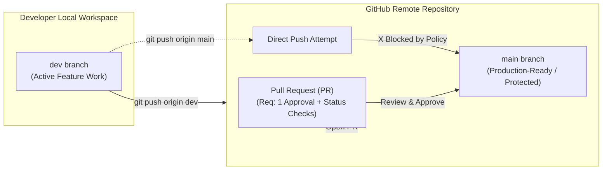

# Cloud DevOps Production Infrastructure & Configuration Management

This repository contains the complete Infrastructure as Code (IaC) and Configuration Management automation for a two-tier AWS cloud environment hosting containerized microservices. The architecture incorporates remote S3 state storage with DynamoDB state locking, SSH tunneling via a Bastion host, security group chaining, OS security hardening, user provisioning, UFW firewall configuration, and Docker runtime installation.

---

## Table of Contents
1. [Architecture Overview](#architecture-overview)
2. [Architectural & Process Diagrams](#architectural--process-diagrams)
3. [Directory Structure](#directory-structure)
4. [Phase-by-Phase Implementation Breakdown](#phase-by-phase-implementation-breakdown)
   - [Phase 1: Git & Project Setup](#phase-1-git--project-setup)
   - [Phase 2: Infrastructure as Code (Terraform)](#phase-2-infrastructure-as-code-terraform)
   - [Phase 3: Configuration Management & Security (Ansible)](#phase-3-configuration-management--security-ansible)
5. [Troubleshooting & Resolution Audit Log](#troubleshooting--resolution-audit-log)
6. [Verification & Validation Commands](#verification--validation-commands)

---

## Architecture Overview

The system provisions an isolated Virtual Private Cloud (VPC) across public and private subnets:

* **VPC (`10.0.0.0/16`)**: Isolated network environment with DNS hostnames and DNS resolution enabled.
* **Public Subnet (`10.0.1.0/24`)**: Hosts an Internet Gateway (IGW), an Elastic IP-backed NAT Gateway, and a public **Bastion Host** (`t3.micro`).
* **Private Subnet (`10.0.2.0/24`)**: Holds the **Application Host** (`t3.small`) with no direct public IP. Outbound internet connectivity for OS updates and Docker package downloads is routed through the NAT Gateway.
* **Security Group Chaining**: Restricts administrative SSH access (Port 22) on the Application Server to accept traffic exclusively originating from the Bastion Security Group (`bastion_sg.id`).

```text
                                [ Internet / Admin ]
                                         │
                                   ( Port 22 SSH )
                                         ▼
                   ┌───────────────────────────────────────────┐
                   │  VPC (10.0.0.0/16)                        │
                   │                                           │
                   │   ┌───────────────────────────────────┐   │
                   │   │ Public Subnet (10.0.1.0/24)       │   │
                   │   │                                   │   │
                   │   │   ┌───────────────────────────┐   │   │
                   │   │   │ Bastion Host (t3.micro)   │   │   │
                   │   │   │ Public IP: 44.193.198.228 │   │   │
                   │   │   └─────────────┬─────────────┘   │   │
                   │   │                 │                 │   │
                   │   │          [ NAT Gateway ]          │   │
                   │   └─────────────────┼─────────────────┘   │
                   │                     │                     │
                   │   ┌─────────────────┼─────────────────┐   │
                   │   │ Private Subnet  ▼ (10.0.2.0/24)  │   │
                   │   │                                   │   │
                   │   │   ┌───────────────────────────┐   │   │
                   │   │   │ Application Host          │   │   │
                   │   │   │ Private IP: 10.0.2.78     │   │   │
                   │   │   └───────────────────────────┘   │   │
                   │   └───────────────────────────────────┘   │
                   └───────────────────────────────────────────┘
```

---

## Architectural & Process Diagrams

### 1. High-Level System Architecture & Network Topology


---

### 2. Remote State & Locking Mechanism (S3 + DynamoDB)
Terraform uses an AWS S3 bucket for central state storage and DynamoDB for state locking to prevent race conditions during concurrent deployments.



---

### 3. Ansible SSH ProxyCommand Tunneling Flow
Ansible uses SSH ProxyCommand settings in `ansible.cfg` to automatically tunnel through the public Bastion host to manage the private Application host.



---

### 4. Git Branching & Protection Workflow


---

## Directory Structure

```text
.
├── .github/
│   └── ISSUE_TEMPLATE/
│       ├── bug_report.md
│       ├── feature_request.md
│       └── task.md
├── ansible/
│   ├── ansible.cfg
│   ├── group_vars/
│   │   └── all/
│   │       ├── main.yml
│   │       └── vault.yml
│   ├── inventory/
│   │   ├── hosts.ini
│   │   └── tf_outputs.json
│   └── playbooks/
│       ├── 01_security.yml
│       ├── 02_docker.yml
│       └── site.yml
├── terraform/
│   ├── backend.tf
│   ├── ec2.tf
│   ├── gateways.tf
│   ├── outputs.tf
│   ├── provider.tf
│   ├── route_tables.tf
│   ├── security_groups.tf
│   ├── subnets.tf
│   ├── variables.tf
│   └── vpc.tf
├── .gitignore
└── README.md
```

---

## Phase-by-Phase Implementation Breakdown

### Phase 1: Git & Project Setup
1. **Repository Setup**: Initialized public repository `cloud-devops-lab-26` with `main` and `dev` branches.
2. **Branch Protection**: Enabled protection rules on `main` requiring Pull Request (PR) reviews (1 approval minimum), enforcing status checks, blocking force pushes (`git push --force`), and preventing branch deletions.
3. **Issue Templates & Kanban Board**: Created structured issue templates inside `.github/ISSUE_TEMPLATE/` (`bug_report.md`, `feature_request.md`, `task.md`) linked directly to a GitHub Projects Kanban board (`Todo`, `In Progress`, `Done`).
4. **Git Ignore Hierarchy**: Established a root `.gitignore` file to ensure temporary caches, credentials, SSH `.pem` keys, and Terraform state files are never committed.

---

### Phase 2: Infrastructure as Code (Terraform)
1. **Remote Backend Bootstrap**: Configured an AWS S3 bucket (`cloud-devops-tf-state-2026`) with bucket versioning and SSE-S3 encryption enabled, alongside an AWS DynamoDB table (`terraform-state-locks`) with primary partition key `LockID` (String).
2. **Network Layer Provisioning**:
   - `vpc.tf`: Defined core VPC (`10.0.0.0/16`) with DNS hostnames and resolution enabled.
   - `subnets.tf`: Provisioned Public Subnet (`10.0.1.0/24`) and Private Subnet (`10.0.2.0/24`).
   - `gateways.tf`: Deployed an Internet Gateway (IGW) attached to the VPC and an Elastic IP-backed NAT Gateway in the public subnet.
   - `route_tables.tf`: Created public route table (`0.0.0.0/0 -> IGW`) and private route table (`0.0.0.0/0 -> NAT Gateway`).
3. **Security Groups & Compute Layer**:
   - `security_groups.tf`: Implemented Security Group Chaining—`bastion_sg` permits SSH (Port 22) from authorized IPs, while `app_sg` permits SSH exclusively from `bastion_sg.id`.
   - `ec2.tf`: Deployed `t3.micro` Bastion host (public subnet) and `t3.small` App Server (private subnet, with explicit `depends_on = [aws_nat_gateway.nat]`).
4. **Outputs Handoff**:
   - Exported dynamic infrastructure IP attributes via `outputs.tf` and saved formatted JSON to `ansible/inventory/tf_outputs.json`:
     ```bash
     mkdir -p ../ansible/inventory
     terraform output -json > ../ansible/inventory/tf_outputs.json
     ```

---

### Phase 3: Configuration Management & Security (Ansible)
1. **SSH Tunneling Configuration (`ansible.cfg`)**:
   Configured Ansible with `ProxyCommand` to automatically tunnel SSH requests through the public Bastion host to manage the private 10.0.2.x IP host seamlessly.
2. **Inventory Mapping (`inventory/hosts.ini`)**:
   Categorized target hosts into `[bastion_nodes]` and `[app_nodes]` groups mapping dynamic AWS public and private IPs.
3. **Vault Encryption (`group_vars/all/vault.yml`)**:
   Encrypted sensitive variables (sudo user credentials, Docker Hub access tokens) using AES-256 via Ansible Vault:
   ```bash
   ansible-vault encrypt group_vars/all/vault.yml
   ```
4. **OS Security Hardening Playbook (`playbooks/01_security.yml`)**:
   - Updated system APT package cache and upgraded packages.
   - Installed essential administrative utilities (`curl`, `git`, `htop`, `ufw`, `fail2ban`, `python3-pip`).
   - Created administrative `devops` user with passwordless sudo access (`/etc/sudoers.d/devops`).
   - Applied UFW firewall rules (Allow TCP 22, 80, 443; default deny inbound).
   - Hardened SSH configuration (`PermitRootLogin no`) and restarted SSH daemon.
5. **Runtime & Docker Installation Playbook (`playbooks/02_docker.yml`)**:
   - Downloaded Docker official GPG key and de-armored it to binary format `/etc/apt/keyrings/docker.gpg`.
   - Configured `deb822_repository` APT source for Docker.
   - Updated APT cache and installed `docker-ce`, `docker-ce-cli`, `containerd.io`, and `docker-compose-plugin`.
   - Added `ubuntu` and `devops` users to the `docker` Linux system group.
   - Pulled test Docker images (`hello-world`, `ubuntu`) and initiated test containers.
6. **Master Orchestration Playbook (`playbooks/site.yml`)**:
   Orchestrated the execution sequence of `01_security.yml` followed by `02_docker.yml`.

---

## Verification & Validation Commands

Run these commands to verify that the environment and automation layers are fully operational:

1. **Verify Infrastructure State & Remote Lock**:
   ```bash
   cd terraform/
   terraform plan
   ```
2. **Verify SSH Tunneling through Bastion to Private App Host**:
   ```bash
   ssh -J ubuntu@Public_IP_Bastion_Host ubuntu@Private_IP_App_Server
   ```
3. **Verify Ansible Connectivity across All Nodes**:
   ```bash
   cd ansible/
   ansible all -m ping --ask-vault-pass
   ```
4. **Verify Administrative `devops` User & Sudo Privileges**:
   ```bash
   ssh -J ubuntu@Public_IP_Bastion_Host devops@Private_IP_App_Server "sudo ufw status verbose"
   ```
5. **Verify Docker & Docker Compose Plugin on Private App Host**:
   ```bash
   ansible app_nodes -m shell -a "docker --version && docker compose version && docker ps"
   ```
