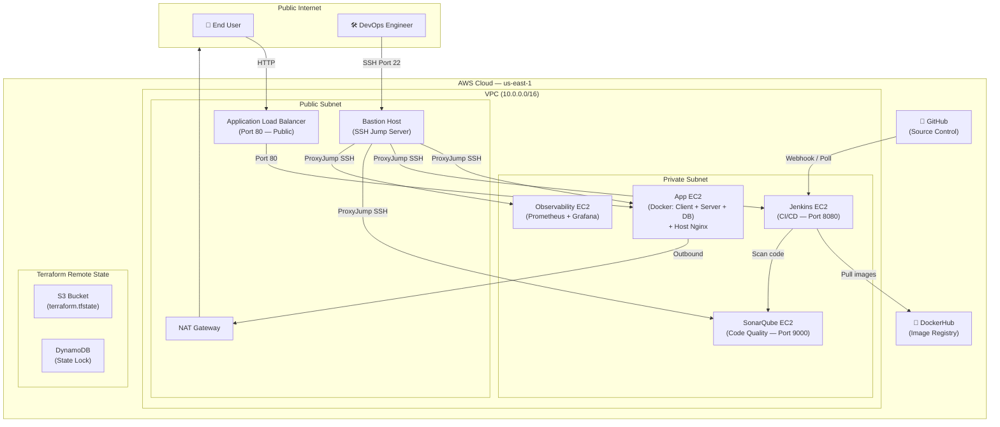
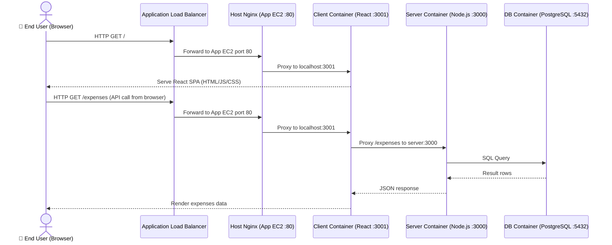
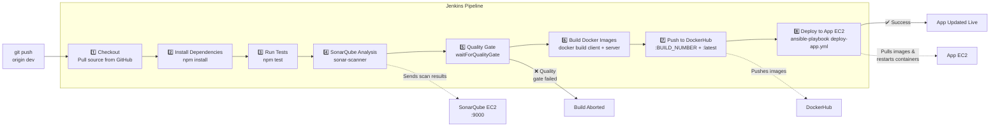
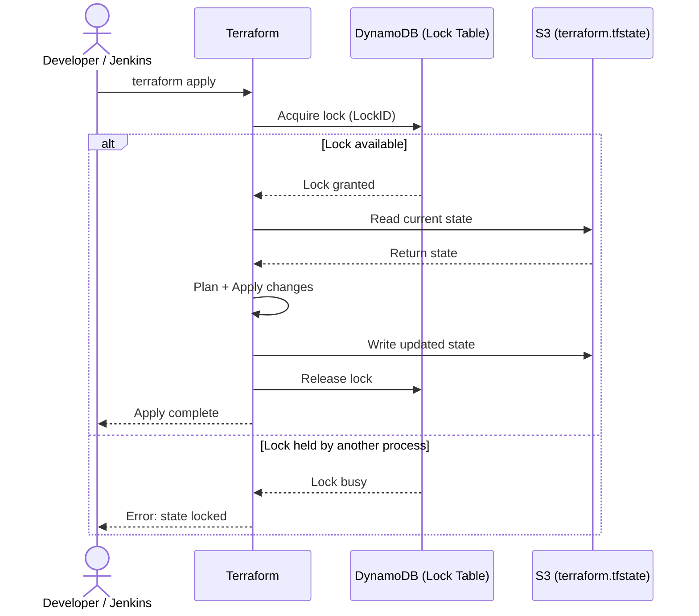
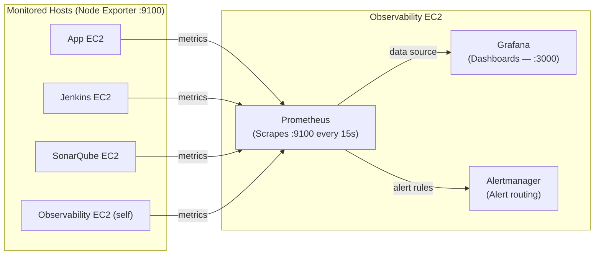

# Cloud DevOps Lab 26 — Expenses Tracker

> A production-grade AWS deployment of a full-stack expenses tracking application, built with a complete DevOps pipeline: Infrastructure as Code, Configuration Management, CI/CD, Code Quality, Containerisation, and Observability.

[](https://www.terraform.io/)
[](https://www.ansible.com/)
[](https://www.jenkins.io/)
[](https://www.sonarqube.org/)
[](https://www.docker.com/)
[](https://aws.amazon.com/)

---

## Table of Contents

1. [Architecture Overview](#1-architecture-overview)
2. [Technology Stack](#2-technology-stack)
3. [Traffic Flow](#3-traffic-flow)
4. [CI/CD Pipeline](#4-cicd-pipeline)
5. [Monitoring Architecture](#5-monitoring-architecture)
6. [Project Structure](#6-project-structure)
7. [Prerequisites](#7-prerequisites)
8. [Phase 1 — Infrastructure with Terraform](#8-phase-1--infrastructure-with-terraform)
9. [Phase 2 — SSH Access via Bastion](#9-phase-2--ssh-access-via-bastion)
10. [Phase 3 — Server Configuration with Ansible](#10-phase-3--server-configuration-with-ansible)
11. [Phase 4 — Configure Jenkins](#11-phase-4--configure-jenkins)
12. [Phase 5 — Configure SonarQube](#12-phase-5--configure-sonarqube)
13. [Phase 6 — First Deployment](#13-phase-6--first-deployment)
14. [Phase 7 — Full CI/CD Pipeline](#14-phase-7--full-cicd-pipeline)
15. [Accessing Services](#15-accessing-services)
16. [Secrets Management](#16-secrets-management)

---

## 1. Architecture Overview

The infrastructure is deployed on AWS inside a custom VPC. All application workloads run in a **private subnet** with no direct internet access. A **Bastion host** in the public subnet provides secure administrative SSH access. An **Application Load Balancer (ALB)** in the public subnet routes user traffic to the application.



### EC2 Instances

| Server | Subnet | Role |
|---|---|---|
| Bastion Host | Public | SSH jump server into private subnet |
| App EC2 | Private | Runs Docker containers + host Nginx reverse proxy |
| Jenkins EC2 | Private | CI/CD server (Jenkins, native install) |
| SonarQube EC2 | Private | Static code analysis (native install) |
| Observability EC2 | Private | Prometheus + Grafana monitoring (native install) |

> All tooling servers (Jenkins, SonarQube, Observability) are accessed via **SSH port forwarding** tunnelled through the Bastion — they are never exposed to the public internet.

---

## 2. Technology Stack

| Category | Tool | Purpose |
|---|---|---|
| **Cloud** | AWS (VPC, EC2, ALB, S3, IAM, NAT GW) | Infrastructure provider |
| **IaC** | Terraform + S3 backend | Provision and version-control all AWS resources |
| **Configuration** | Ansible + Ansible Vault | Install and configure all servers |
| **CI/CD** | Jenkins | Automate build, test, and deploy pipeline |
| **Code Quality** | SonarQube + sonar-scanner | Static analysis and quality gate |
| **Containerisation** | Docker + Docker Compose | Run app containers on App EC2 |
| **Image Registry** | DockerHub | Store and distribute app Docker images |
| **Reverse Proxy** | Nginx (host-level) | Route ALB traffic into client container |
| **Frontend** | React + Vite | Student expenses tracker UI |
| **Backend** | Node.js + Express | REST API for expenses data |
| **Database** | PostgreSQL 16 | Persistent relational data storage |
| **Monitoring** | Prometheus + Grafana | Metrics collection and dashboards |

---

## 3. Traffic Flow

### Public User Request



---

## 4. CI/CD Pipeline

Every push to the `dev` branch triggers a full automated pipeline in Jenkins:



### Terraform State Locking



---

## 5. Monitoring Architecture



---

## 6. Project Structure

```
Cloud-DevOps-Lab-26/
├── Jenkinsfile                         # 8-stage CI/CD pipeline definition
├── sonar-project.properties            # SonarQube scanner configuration
├── .gitignore
│
├── app/                                # Application source code
│   ├── client/                         # React + Vite frontend
│   │   ├── Dockerfile                  # Multi-stage: Node build → Nginx serve
│   │   ├── nginx.conf                  # In-container Nginx config
│   │   └── src/                        # React components, pages, hooks
│   ├── server/                         # Node.js + Express backend
│   │   ├── Dockerfile                  # Production Node.js image
│   │   ├── server.js                   # App entry point
│   │   ├── src/                        # Routes, controllers, models, config
│   │   └── db/init.sql                 # PostgreSQL schema initialisation
│   └── package.json                    # Root workspace convenience scripts
│
├── docker/
│   └── app/
│       └── docker-compose.yml          # Production compose: db + server + client
│
├── ansible/
│   ├── inventory/
│   │   └── hosts.ini                   # Host IPs + Bastion ProxyJump config
│   ├── group_vars/all/
│   │   ├── main.yml                    # Shared variables (ports, usernames)
│   │   └── vault.yml                   # AES-256 encrypted secrets
│   ├── templates/
│   │   ├── app-nginx.conf.j2           # Host Nginx reverse proxy config
│   │   ├── app.env.j2                  # Runtime .env for docker-compose
│   │   └── prometheus.yml.j2           # Prometheus scrape targets
│   └── playbooks/
│       ├── site.yml                    # Master: security hardening on all nodes
│       ├── deploy-app.yml              # Deploy containers + Nginx on App EC2
│       ├── deploy-jenkins.yml          # Jenkins + Docker + Ansible + sonar-scanner
│       ├── deploy-sonarqube.yml        # SonarQube + PostgreSQL backend
│       ├── deploy-observability.yml    # Prometheus + Grafana + Alertmanager
│       ├── security.yml                # UFW firewall + SSH hardening
│       └── docker.yml                  # Docker CE install for App EC2
│
└── terraform/
    ├── main.tf                         # Provider config + S3 backend
    ├── variables.tf                    # Variable declarations
    ├── terraform.tfvars                # Local variable values (not committed)
    ├── vpc.tf                          # VPC, subnets, IGW, NAT, route tables
    ├── sg.tf                           # Security groups for all servers
    ├── bastion.tf                      # Bastion host EC2
    ├── app_ec2.tf                      # App server EC2
    ├── tools_ec2.tf                    # Jenkins, SonarQube, Observability EC2s
    ├── alb.tf                          # ALB + target group + listener
    └── outputs.tf                      # Exported IPs and DNS names
```

---

## 7. Prerequisites

Install the following on your **local machine**:

```bash
# Terraform (v1.5+)
sudo apt install terraform

# AWS CLI
sudo apt install awscli
aws configure
# Enter: Access Key ID, Secret Access Key, Region (us-east-1), Output (json)

# Ansible (v2.14+) and required collections
sudo apt install ansible
ansible-galaxy collection install community.docker
ansible-galaxy collection install community.general
ansible-galaxy collection install ansible.posix

# Docker (for building images locally before pipeline takes over)
# Install Docker Engine or Docker Desktop

# SSH keypair — download from AWS and place at:
chmod 400 ~/.ssh/<your-keypair>.pem
```

---

## 8. Phase 1 — Infrastructure with Terraform

```bash
cd terraform/

# 1. Get your current public IP (used in bastion security group rule)
curl ifconfig.me

# 2. Set your values in terraform.tfvars
#    my_ip            = "<YOUR_IP>/32"
#    public_key_path  = "~/.ssh/<your-keypair>.pub"
#    environment      = "dev"

# 3. Initialise Terraform — downloads providers, connects to S3 backend
terraform init

# 4. Preview all resources that will be created
terraform plan

# 5. Provision infrastructure (~3–5 minutes)
terraform apply -auto-approve

# 6. Save the outputs — you'll need these IPs for Ansible and SSH config
terraform output
```

**You will receive these output values:**

| Output | Description |
|---|---|
| `alb_dns_name` | Public URL to access the application |
| `bastion_public_ip` | Bastion host public IP for SSH config |
| `app_private_ip` | App EC2 private IP |
| `jenkins_private_ip` | Jenkins EC2 private IP |
| `sonarqube_private_ip` | SonarQube EC2 private IP |
| `observability_private_ip` | Observability EC2 private IP |

---

## 9. Phase 2 — SSH Access via Bastion

Add all servers to `~/.ssh/config`, replacing placeholders with your Terraform outputs:

```
Host bastion
    HostName <BASTION_PUBLIC_IP>
    User ubuntu
    IdentityFile ~/.ssh/<your-keypair>.pem

Host app-server
    HostName <APP_PRIVATE_IP>
    User ubuntu
    IdentityFile ~/.ssh/<your-keypair>.pem
    ProxyJump bastion

Host jenkins
    HostName <JENKINS_PRIVATE_IP>
    User ubuntu
    IdentityFile ~/.ssh/<your-keypair>.pem
    ProxyJump bastion

Host sonarqube
    HostName <SONARQUBE_PRIVATE_IP>
    User ubuntu
    IdentityFile ~/.ssh/<your-keypair>.pem
    ProxyJump bastion

Host observability
    HostName <OBSERVABILITY_PRIVATE_IP>
    User ubuntu
    IdentityFile ~/.ssh/<your-keypair>.pem
    ProxyJump bastion
```

**Test all connections:**
```bash
ssh bastion       "echo bastion OK"
ssh app-server    "echo app OK"
ssh jenkins       "echo jenkins OK"
ssh sonarqube     "echo sonarqube OK"
ssh observability "echo observability OK"
```

Also update `ansible/inventory/hosts.ini` with the same private IPs.

---

## 10. Phase 3 — Server Configuration with Ansible

### 10a. Create Ansible Vault (encrypted secrets)

```bash
cd ansible/

# Create the encrypted vault file — you will be prompted for a password
ansible-vault create group_vars/all/vault.yml
```

The vault must define these variables:
```yaml
vault_db_user: "your_postgres_user"
vault_db_password: "your_secure_password"
vault_devops_password: "hashed_linux_user_password"
vault_docker_hub_username: "your_dockerhub_username"
```

To edit later: `ansible-vault edit group_vars/all/vault.yml`

### 10b. Security harden all servers

```bash
ansible-playbook -i inventory/hosts.ini playbooks/site.yml --ask-vault-pass
```

Applies UFW firewall rules, SSH hardening, and creates an admin `devops` user on every EC2.

### 10c. Install Jenkins

```bash
ansible-playbook -i inventory/hosts.ini playbooks/deploy-jenkins.yml
```

Installs: OpenJDK 21, Jenkins, Docker CE, Docker Compose plugin, Ansible, sonar-scanner CLI, Prometheus Node Exporter.

### 10d. Install SonarQube

```bash
ansible-playbook -i inventory/hosts.ini playbooks/deploy-sonarqube.yml --ask-vault-pass
```

Installs: PostgreSQL (SonarQube backend), SonarQube Community Edition, Prometheus Node Exporter.

> **Note for small instances:** The playbook automatically creates a **2 GB swap file** before starting SonarQube. This prevents out-of-memory crashes on `t2.micro` / `t3.micro` instances (which only have 1 GB RAM, while SonarQube requires 2 GB).

### 10e. Install Observability Stack

```bash
ansible-playbook -i inventory/hosts.ini playbooks/deploy-observability.yml --ask-vault-pass
```

Installs: Prometheus, Grafana, Alertmanager. Prometheus is configured to scrape Node Exporter on all other EC2s.

---

## 11. Phase 4 — Configure Jenkins

**Open an SSH tunnel** (keep this terminal open):
```bash
ssh -N -L 8080:<JENKINS_PRIVATE_IP>:8080 bastion
```
Open: **http://localhost:8080**

**Get the initial admin password:**
```bash
ssh jenkins "sudo cat /var/lib/jenkins/secrets/initialAdminPassword"
```

**Install suggested plugins**, then also install:

| Plugin | Purpose |
|---|---|
| SonarQube Scanner | SonarQube integration |
| Docker Pipeline | Docker commands in Jenkinsfile |
| SSH Agent | SSH key injection for Ansible |

**Add SonarQube server** → Manage Jenkins → System → SonarQube servers:
- Name: `SonarQube` ← must match the `Jenkinsfile` exactly
- URL: `http://<SONARQUBE_PRIVATE_IP>:9000`
- Token: add a Secret Text credential with ID `Jenkins-Token` (generated in Phase 5)

**Add credentials** → Manage Jenkins → Credentials → Global:

| Credential ID | Kind | Value |
|---|---|---|
| `dockerhub-credentials` | Username with password | DockerHub username + Personal Access Token (Read & Write) |
| `ansible-vault-password` | Secret file | A `.txt` file containing only your vault password |
| `ssh-private-key` | SSH Username with private key | Username: `ubuntu` + your `.pem` key content |
| `Jenkins-Token` | Secret text | SonarQube analysis token (generated in Phase 5) |

**Create the pipeline job** → New Item → Pipeline → `expenses-tracker`:
- Definition: Pipeline script from SCM
- SCM: Git
- Repository URL: `https://github.com/<your-username>/<your-repo>.git`
- Branch: `*/dev`
- Script Path: `Jenkinsfile`

---

## 12. Phase 5 — Configure SonarQube

**Open an SSH tunnel** (keep this terminal open):
```bash
ssh -N -L 9000:<SONARQUBE_PRIVATE_IP>:9000 bastion
```
Open: **http://localhost:9000**

**Initial setup:**
1. Login: `admin` / `admin` — change the password when prompted
2. My Account (top right) → **Security** → Generate Token
   - Name: `jenkins-token`
   - Type: **Global Analysis Token**
   - Click **Generate** — copy it immediately (shown once only)
3. Add the copied token to Jenkins as a Secret Text credential with ID `Jenkins-Token`

**Create the project:**
- Projects → Create Project → Manually
- Project key: `cloud-devops-lab-26` ← must match `sonar-project.properties`
- Display name: `Cloud DevOps Lab 26`

---

## 13. Phase 6 — First Deployment

> Run this once to get your images on DockerHub. After this, Jenkins handles every deployment automatically.

**Build and push images locally:**
```bash
# Login using a PAT with Read & Write scope
docker login -u <your-dockerhub-username>

# Build
docker build -t <your-dockerhub-username>/expenses-client:latest ./app/client/
docker build -t <your-dockerhub-username>/expenses-server:latest ./app/server/

# Push
docker push <your-dockerhub-username>/expenses-client:latest
docker push <your-dockerhub-username>/expenses-server:latest
```

**Deploy to the App EC2:**
```bash
cd ansible/
ansible-playbook -i inventory/hosts.ini playbooks/deploy-app.yml --ask-vault-pass
```

This playbook:
1. Creates `/opt/expenses-tracker/` on the App EC2
2. Copies `docker-compose.yml`, `init.sql`, and generates `.env` from vault secrets
3. Adds `ubuntu` to the `docker` group
4. Pulls images and starts all 3 containers via `docker compose up`
5. Installs and configures host Nginx as a reverse proxy on port 80
6. Installs Prometheus Node Exporter

**Verify the deployment:**
```bash
# All 3 containers should show as "Up"
ssh app-server "sudo docker ps"

# Host Nginx health check
ssh app-server "curl -s http://localhost/health"

# API health check
ssh app-server "curl -s http://localhost:3000/"
```

**Access the application:**
```
http://<ALB_DNS_NAME>
```

---

## 14. Phase 7 — Full CI/CD Pipeline

Every future deployment is triggered automatically by a git push:

```bash
git add .
git commit -m "Your feature description"
git push origin dev
```

Then in Jenkins → `expenses-tracker` → **Build Now** (or set up a webhook for automatic triggering).

### Pipeline Stage Summary

| # | Stage | Action |
|---|---|---|
| 1 | Checkout | Pull latest commit from GitHub |
| 2 | Install Dependencies | `npm install` in workspace |
| 3 | Run Tests | `npm test --passWithNoTests` |
| 4 | SonarQube Analysis | `sonar-scanner` → results sent to SonarQube EC2 |
| 5 | Quality Gate | Wait up to 5 min — abort if quality gate fails |
| 6 | Build Docker Images | `docker build` for client and server |
| 7 | Push to DockerHub | Push `:BUILD_NUMBER` tag and `:latest` |
| 8 | Deploy to App EC2 | `ansible-playbook deploy-app.yml` with `image_tag=BUILD_NUMBER` |

---

## 15. Accessing Services

All internal services are accessed via SSH port forwarding through the Bastion host.

**Start all tunnels in one command** (keep this terminal open while working):

```bash
ssh -N \
  -L 8080:<JENKINS_PRIVATE_IP>:8080 \
  -L 9000:<SONARQUBE_PRIVATE_IP>:9000 \
  -L 3000:<OBSERVABILITY_PRIVATE_IP>:3000 \
  bastion
```

| Service | Local URL | Notes |
|---|---|---|
| Jenkins | http://localhost:8080 | CI/CD pipelines |
| SonarQube | http://localhost:9000 | Code quality reports |
| Grafana | http://localhost:3000 | Monitoring dashboards |
| Application | `http://<ALB_DNS_NAME>` | Publicly accessible |

> The `-N` flag keeps the tunnel open without running any command. The terminal will appear to hang — that is correct. Open new tabs for other work.

---

## 16. Secrets Management

### What is stored where

| Secret | Where stored | How protected |
|---|---|---|
| DB username & password | Ansible Vault (`vault.yml`) | AES-256 encrypted |
| DockerHub username | Ansible Vault (`vault.yml`) | AES-256 encrypted |
| Linux user password | Ansible Vault (`vault.yml`) | AES-256 encrypted |
| SonarQube token | Jenkins Credentials | Jenkins internal store |
| DockerHub PAT | Jenkins Credentials | Jenkins internal store |
| EC2 SSH private key | Jenkins Credentials | Jenkins internal store |
| Ansible vault password | Jenkins Credentials (secret file) | Jenkins internal store |
| App runtime `.env` | Auto-generated on App EC2 by Ansible | Never committed to Git |

### What is never committed to Git

- `.env` files
- `*.pem` / `*.key` SSH private keys
- `terraform.tfstate` (stored in S3 instead)
- Vault password files
- Real IP addresses in configuration (use variables/outputs)

All of these are covered by `.gitignore` at the project root.

